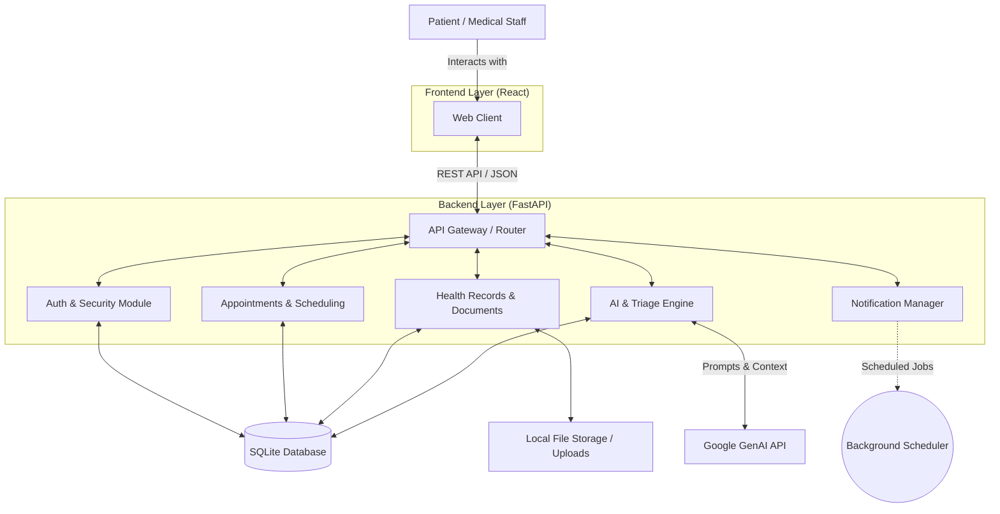

# MedBridge High-Level Architecture

This document provides a high-level overview of the MedBridge system architecture, focusing on the major modules and how they interact.

## Architecture Diagram

## Major System Modules

### 1. Web Client (Frontend)
The user-facing application built on **React**. It serves as the primary interface for patients to book appointments, view their medical timelines, and chat with the AI triage agent.

### 2. API Gateway / Core Router (Backend)
Built on **FastAPI**, this is the central nervous system of the application. It receives all incoming HTTP requests, enforces CORS policies, and routes traffic to the appropriate domain modules.

### 3. Authentication & Security
Handles user registration, login, and access control. It issues JWTs (JSON Web Tokens) and ensures that users can only access their own medical data or data shared with them.

### 4. Appointments & Scheduling
Manages the core booking logic. It handles clinic availability, doctor schedules, and the creation/modification of patient appointments.

### 5. Health Records & Documents
Responsible for managing medical data. This includes handling file uploads (PDFs, images), performing Optical Character Recognition (OCR) to extract text from medical labels, and generating QR codes or PDF summaries.

### 6. AI & Triage Engine
The intelligence layer of the application. It aggregates patient data (timeline, medical snapshot) and communicates with the **Google GenAI** API to provide preliminary medical triage, summarize documents, and power the interactive AI assistant.

### 7. Notification Manager
Manages automated communications. Powered by a background task runner, it monitors upcoming appointments 

### 8. Data & Storage Layer
The persistence layer of the system.
* **Relational Database:** A local **SQLite** database stores all structured data (users, appointments, clinic info).
* **Local File Storage:** A dedicated volume handles unstructured data like uploaded medical PDFs and images.
